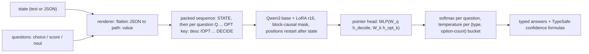

# Leo: build plan for an open, Jev-class System One decision model

Draft v1, 2026-09-26. Scope: mechanisms, architecture, data, training, evaluation, serving, compute, risks.

## 1. Summary

- **What Jev is.** The public evidence fits a pretrained causal LLM run in prefill-only mode. The state is encoded once, each question is an isolated branch that attends to the state, the options inside a question are read together, and a small readout turns hidden states into one probability per option. Nothing is generated. Probabilities are trained against outcomes with proper scoring rules (TypeSafe calls this RLCD) and summarised by fixed confidence formulas.
- **What Leo copies.** The computation and the API contract, not Jev's weights or outputs: an Apache-2.0 base (Qwen3 / Qwen3.5), a LoRA adapter, a pointer readout, a block-causal packed layout, proper-scoring-rule training, per-bucket temperature calibration, served on the same `POST /v1/systemone` wire format.
- **"From scratch" means** our own architecture, head, data pipeline, training, calibration and serving. It does not mean pretraining a base LLM. Jev's breadth (about 85% on MMLU-Pro in [third-party probes](https://archerhume.com/posts/jevs-architecture-unmasked/)) comes from frontier-scale pretraining. That is out of reach and not needed: every strong open reproduction starts from a pretrained base.
- **The recipe is proven in the open.** [Kev-4B](https://github.com/jaredpalmer/kev) is 4 points behind Jev on unseen sources, [decider-4b](https://github.com/Mapika/decider) edges Jev on [JevBench](https://github.com/fstandhartinger/jevbench) v1.4.2 (64.13 vs 63.29). Encoder-based attempts trail Jev by 10 to 33 points zero-shot in an [independent frozen-protocol study](https://github.com/elcronos/jev-vs-open-decision-models). Leo follows the decoder recipe.
- **Data** is public human-labelled datasets plus code-generated families with verifiable labels, optionally relabelled by an open teacher model. The core mixture needs no Hugging Face login. Nothing is trained on Jev outputs, because [TypeSafe's customer agreement §2.3](https://typesafe.ai/legal/mca) forbids it; Jev is called live only to score it next to Leo (§11).
- **Compute.** Phase 0 runs on the local RTX 3050 (Qwen3-0.6B). A production candidate needs a 4B to 9B base on one rented H100 (about $50 to $300 per full run with ablations). Matching Jev on knowledge-heavy questions needs a 30B-class MoE base.
- **Phase 0 result (§12).** Leo-0.6B averages 0.616 accuracy on four held-out datasets against live Jev's 0.689, 0.61 on JevBench against 0.86, 0.46 on a blind multilingual suite against 0.86, and passes 0 of 21 browser runs against Jev's 10. Phase 1 (§13) trains Qwen3-1.7B on Kaggle with 2.3× the data, multilingual sets and real-website browser steps.

## 2. How Jev works

### 2.1 Public contract (TypeSafe docs)

| Area | What TypeSafe documents | Leo design |
|---|---|---|
| Endpoint | `POST /v1/systemone` with `state`, `model`, `questions`; `GET /v1/models`; errors 401, 422, 429, 529 ([API](https://docs.typesafe.ai/api)) | Same wire format, so TypeSafe SDKs work by changing the base URL |
| State | String, JSON object or JSON array. All questions see the same state. Questions point at parts with backtick paths such as `` `ticket.messages[0].text` `` ([State](https://docs.typesafe.ai/concepts/state)) | JSON is flattened into `path: value` lines so every path appears verbatim next to its value |
| Choice | `criteria` maps option key to description (string, object, array or null), up to 255 options. Returns `choice`, `probabilities`, `confidence`. Keys and descriptions are sent to the model; question IDs are not | Pointer readout over per-option end markers, question ID never rendered |
| Score | Ordered array of 2 to 10 levels. `score = Σ i·pᵢ`, plus `legend`. The model never sees level numbers or neighbours; each level is judged against the state | Levels rendered without numbers; ordinal (RPS) term in the loss; shuffled level order in training |
| Noul | Probability of yes; optional `criteria.true` / `criteria.false`; no confidence field | Two-slot readout (no / yes), slot order randomised in training |
| Confidence | Choice: `(K·p_max − 1)/(K − 1)`. Score: `max(0, 1 − Σ pᵢ·abs(i − mode)/D)`, `D = mean abs(i − (n−1)/2)` (TypeSafe's [system-one-adapter](https://github.com/typesafe-ai/system-one-adapter-python)) | Identical formulas. Checked against every doc example: 0.57/0.43 on three levels gives 0.355, 0.95/0.05 gives 0.925 |
| Independence | Questions do not see each other; adding or removing one does not change the others | Block-causal mask; positions restart after the state; parity test packed vs separate |
| Limits | 64k tokens per request, 32k for state plus the longest question; text only; $0.042 per million input tokens, output free ([Models](https://docs.typesafe.ai/models)) | Configurable limits; long-context training is a Phase 2 item |
| Customisation | No per-customer weights; adapt via state, instructions and criteria | Same, plus optional per-customer fine-tunes (open weights) |
| Weak spots | Literal reading, counting and arithmetic, date comparison, multi-hop indirection, long irrelevant state, adversarial state, contradictory criteria, no structural invariants between questions, no generation ([jev-1.13 jaggedness](https://docs.typesafe.ai/model-jaggedness/jev-1.13)) | Expect the same. Keep maths and dates in code, add targeted synthetic families, document limits |

### 2.2 What black-box measurements add

From [Archer Hume's API study](https://archerhume.com/posts/jevs-architecture-unmasked/) (observations and inferences, not TypeSafe statements):

- `output_tokens` is computed from the serialised response; latency stays flat as options grow. There is no decode loop.
- Token accounting is additive (shared prefix plus per-question suffix), and a 23k-token state with 5,000 questions fits the 64k request limit. The state is processed once and shared.
- Moving a fact from a sibling question into the state changes the answer. Questions are isolated; the state is shared.
- Appending an irrelevant option changes the odds between two existing options. Options are processed jointly, not scored independently.
- Delimiter-looking text in the input cannot forge option boundaries. Boundaries use reserved markers.
- Reversing option order moves probabilities by several points. Jev is order-sensitive too.
- Probabilities come back rounded to 2 decimals, and identical calls can differ slightly.
- Inferred, lowest certainty: a sparse MoE causal decoder (about 160 ms for 30k tokens at its knowledge level). Its tokenizer matches no public tokenizer.

### 2.3 RLCD, unpacked

A scoring rule `S(q, y)` is strictly proper when `E_{y∼p}[S(q, y)]` is maximised only at `q = p`. Rewarding a policy with a proper score therefore pays most for honest probabilities. A typical policy-gradient version samples Gaussian noise on the logits, scores each noisy distribution with log + spherical (+ RPS for ordinal) and applies REINFORCE with a group-mean baseline.

For a single decision with a known label, the log-score reward is the negative cross-entropy, so maximising expected reward and minimising log/Brier/RPS loss are the same objective. The policy-gradient version is a noisier estimate of a gradient we can compute exactly. RL adds something only when the reward cannot be differentiated or arrives later: outcomes observed after acting (browser or game episodes, as in decider's RL stage), multi-turn prefixes scored against a terminal outcome (TD(λ)), and cost-sensitive act/escalate policies. Leo trains Stage 1 with proper losses directly and keeps an RL stage for outcome-grounded data. Every open reproduction ships over-confident before post-hoc temperature scaling, so Stage 3 is not optional.

## 3. What the open reproductions teach

| Project | Backbone | Readout | Training | Result vs Jev |
|---|---|---|---|---|
| [Kev](https://github.com/jaredpalmer/kev) | Qwen3.5 0.8B to 27B, LoRA r16 | Pointer: `</opt>` state vs `<decide>` state | Cross-entropy, 12.6k examples × 2 epochs, fitted temperature | Unseen sources: Kev-4B 0.817, Kev-27B 0.848, Jev 0.857. Automates 45–57% of decisions at a 5% error budget vs Jev's 70% |
| [decider](https://github.com/Mapika/decider) | Qwen3.5 2B / 4B / 35B-A3B | Option-letter logits at one answer slot | About 95 public datasets plus a Qwen3.5-27B teacher, 1.47M examples; RL on browser and games for the 2B | JevBench v1.4.2 #1 (64.13 vs 63.29). Behind on knowledge (0.51 vs 0.69 on the Decision Index knowledge panel) |
| [SemIf](https://github.com/TheoLeeCJ/SemIf) | Frozen Qwen3.5-4B | Option-letter logits, no training | None | JevBench v1.2: 74.6 vs Jev 75.3 |

Lessons:

1. The base model sets the knowledge ceiling. Every trained open model trails Jev on MMLU-style items.
2. A decoder base with a small head and LoRA generalises to unseen tasks far better than an encoder fine-tuned on a narrow mix.
3. Calibration is a per-type, per-option-count temperature problem, fitted on held-out data.
4. Shuffle option order and vary option keys in training. `true`/`false` style keys and list position change answers in every system measured.
5. Evaluation sets must be held out by source, preferably by task family, and compared on identical prompts.

## 4. Leo architecture



- **Base.** Phase 0: `Qwen/Qwen3-0.6B-Base`. Phase 1: `Qwen/Qwen3-4B-Base` or `Qwen/Qwen3.5-4B-Base`. Phase 2: `Qwen/Qwen3.5-9B-Base` or `Qwen/Qwen3.5-35B-A3B-Base`. All Apache-2.0, ungated. The LM head is dropped, which saves the 152k-vocab logits.
- **Layout.** `<state> …` then, for each question, `<q> type line + instructions`, one `<opt> key: description </opt>` per option, and `<decide>`. The five markers are a separate trainable embedding table outside the vocabulary, so no user string can produce them. User text is tokenised with special-token parsing off.
- **Attention.** Block-causal: a question token sees the state and earlier tokens of its own question. Position IDs restart after the state for every question. This gives exact isolation and computes the state once. Qwen3.5's Gated DeltaNet layers ignore attention masks, so on those bases Leo detects the non-attention layers (`supports_block_mask`) and gives each question its own row (state repeated). A shared state KV cache for those rows is a Phase 1 speed item.
- **Readout.** `logit_k = MLP([W_q·h_decide, W_k·h_optend_k, product])`. `<decide>` follows the full option list, so the readout is listwise. Noul is two options; Score levels are options scored the same way.
- **Trainable parameters.** LoRA on attention and MLP projections, the head and the markers (about 1–2% of the base).
- **Answers.** Softmax gives `probabilities`; code derives `choice`, `score`, `noul` and the confidence fields.

## 5. Data

### 5.1 Sources (Phase 0 and 1 mixture)

| Family | Datasets | Primitive | Licence |
|---|---|---|---|
| Topic | `fancyzhx/ag_news`, `fancyzhx/dbpedia_14`, `community-datasets/yahoo_answers_topics` | choice, binarised noul | unknown, CC-BY-SA-3.0, unknown |
| Intent | `legacy-datasets/banking77`, `clinc/clinc_oos` (with out-of-scope as "none"), `AmazonScience/massive` (en-US) | choice with 5–77 sampled options | CC-BY-4.0, CC-BY-3.0, CC-BY-4.0 |
| Inference | `stanfordnlp/snli`, `nyu-mll/multi_nli`, `nyu-mll/glue` (MRPC, QQP) | choice (3-way), noul | CC-BY-SA-4.0, mixed, mixed |
| Reading and knowledge | `google/boolq`, `allenai/ai2_arc`, `allenai/openbookqa`, `tau/commonsense_qa`, `Rowan/hellaswag`, `allenai/winogrande` | noul, choice | CC-BY-SA, unknown, MIT, n/a |
| Sentiment and ordinal | `stanfordnlp/imdb`, `Yelp/yelp_review_full` | noul, score (5 levels) | other |
| Safety | `deepset/prompt-injections`, `jackhhao/jailbreak-classification`, `google/civil_comments` (rater fraction as a soft noul target), `ucirvine/sms_spam` | noul, score | Apache-2.0, Apache-2.0, CC0, unknown |
| Rubric judging | `nvidia/HelpSteer2` (helpfulness, correctness, coherence, complexity, verbosity 0–4) | score over a structured state `{prompt, response}` | CC-BY-4.0 |

### 5.2 Code-generated families (verifiable gold)

- Policy checks: short policies plus case facts stated in words; code computes whether the policy applies.
- Field references: JSON records addressed by backtick path (`` `orders[2].status` ``), including distractor fields.
- Binarised and "none of the above" variants of every classification source: noul per label, and choice with the gold option removed so `other` is correct.
- Unknowable items: deciding evidence removed; the target is a uniform or 0.5 distribution.
- Multi-question requests: several questions about one state, including speculative irrelevant ones, to exercise isolation.

### 5.3 Augmentation (applied per example)

Option order shuffled; option keys drawn from original labels, snake_case, Title Case or opaque keys (`A`, `opt_3`) with descriptions carrying the meaning; descriptions null, short or structured; state as raw text, `{"message": …}`, nested ticket or email objects, or conversation arrays with distractor fields; 3–6 instruction paraphrases per task; noul phrased as question or statement, with and without `criteria`; high-cardinality sources subsampled to a random option count that always contains the gold label.

### 5.4 Held-out evaluation and contamination policy

The primary benchmark is the four datasets in [elcronos/jev-vs-open-decision-models](https://github.com/elcronos/jev-vs-open-decision-models), which publishes Jev 1.13 numbers under a frozen protocol (same instruction, same bare labels, raw text as state). Jev is run live on the same requests here (`leo.bench.heldout --backend jev`); the live run reproduces the published numbers within 0.003 accuracy on every set, which shows the harness matches the protocol:

| Dataset | Split, rows, labels | Jev 1.13 published acc / macro-F1 / ECE | Jev 1.13 live (2026-09-27) |
|---|---|---|---|
| `dair-ai/emotion` | test, 2,000, 6 | 0.587 / 0.500 / 0.281 | 0.587 / 0.503 / 0.280 |
| `cardiffnlp/tweet_topic_single` | test_2021, 1,693, 6 | 0.793 / 0.694 / 0.063 | 0.790 / 0.693 / 0.064 |
| `zeroshot/twitter-financial-news-topic` | validation, 4,117, 20 | 0.670 / 0.630 / 0.166 | 0.669 / 0.627 / 0.168 |
| `OpenRL/daily_dialog` | test utterances, 7,740, 7 | 0.710 / 0.385 / 0.156 | 0.710 / 0.385 / 0.156 |

Rules: none of these datasets, and no emotion or tweet/financial-topic dataset, enters training, so emotion is a held-out task family, not just a held-out split. Secondary suites: JevBench public items (MIT) and in-distribution dev splits of every training source (used for checkpoint selection and temperature fitting only).

### 5.5 Hugging Face access

No login is needed for anything above. Gated repos found: `allenai/wildguardmix` (automatic approval after accepting terms), `google/gemma-*` and `meta-llama/*` (manual approval). None are in the plan; if we add one, you will need to accept its terms on huggingface.co and run `hf auth login`.

Licence caveats: `facebook/anli`, `PKU-Alignment/BeaverTails`, `lmsys/toxic-chat` and `allenai/sciq` are non-commercial, so they stay out of any commercial release mixture. Several classic sets list "unknown" licences (ag_news, yahoo_answers_topics, sms_spam, openbookqa) and need a legal review before a commercial release. Full table: `results/hf_access.json`.

## 6. Training

| Stage | What | Objective | Notes |
|---|---|---|---|
| S0 | Zero-shot baseline: base model reading option-letter logits | none | Lower bound and a check that the harness works |
| S1 | Supervised decision training on the mixture | Log loss (soft targets where available) + 0.5·RPS on Score questions | LoRA r16/α32, head and markers at a higher LR, cosine schedule, bf16, gradient checkpointing, token-budget batches |
| S2 | RLCD on outcome-grounded data | REINFORCE with logit noise and a group baseline; reward = proper score, or cost matrix for act/escalate | Only where rewards are delayed or non-differentiable (agent traces, multi-turn outcomes) |
| S3 | Calibration | One temperature per (type, option-count bucket) by NLL on in-distribution dev | Never fitted on the benchmark |
| S4 | Customer specialisation | Short fine-tune from the released checkpoint plus a new temperature | Kev saw 0.804 → 0.904 on one real domain with 5k labels |

Checkpoints are selected on dev sets only; the held-out benchmark is read once per candidate.

## 7. Evaluation

- **Metrics:** accuracy, macro-F1, balanced accuracy, multi-class Brier, top-label ECE (15 bins), NLL (clipped at 1e-6), accuracy at 50% and 80% coverage, score MAE.
- **Robustness probes:** option-order flip rate (6 permutations), packed-vs-separate question parity (must match within 1e-3), negation pairs, unknowable items (share answered with ≥0.9 confidence), key-name sensitivity (`yes/no` vs opaque keys).
- **Speed:** p50/p95 model time for 1, 10 and 50 questions at 300 and 2,000 state tokens.
- **Release gates for a production candidate:** within 3 points of Jev's published accuracy on at least 3 of the 4 held-out sets, ECE ≤ 0.10 on each, parity check passing, order flip rate ≤ Jev's measured 0.13.

## 8. Serving

- FastAPI server with `POST /v1/systemone`, `GET /v1/models` and `GET /health`; 401 and 422 errors as TypeSafe documents them, plus 413 for oversized bodies. It has no rate limiting yet, so it never returns 429; put it behind a gateway with per-key limits before exposing it.
- Bearer auth is required whenever `LEO_API_KEY` is set. The server binds to 127.0.0.1 by default and refuses a non-loopback bind without a key.
- Throughput: state computed once per request, questions packed, requests batched by token budget. Phase 2 adds a shared-prefix KV cache, CUDA graphs and fp8/NVFP4 weights.
- Cost reference: Kev-4B on an L40S ($1.95/h) serves about 51 requests/s of six questions, roughly $0.035 per million input tokens at full load, about Jev's $0.042. Self-hosting wins on data control, latency and customisation more than on price.

## 9. Compute and roadmap

| Phase | Goal | Base | Hardware | Estimated cost |
|---|---|---|---|---|
| 0 (now) | End-to-end pipeline, first held-out numbers | Qwen3-0.6B-Base | Local RTX 3050 8 GB | $0; about 1–3 h per run |
| 1 | Production candidate on the four held-out sets | Qwen3-4B / Qwen3.5-4B-Base | 1× H100 80 GB | $50–300 including ablations |
| 2 | Knowledge and long-context gap | Qwen3.5-9B or 35B-A3B MoE; open 27–32B teacher labels | 1–2× H100 | $500–2,000 |
| 3 | Production service | Best Phase 1/2 checkpoint | L40S or H100 autoscaled | Usage-based |

## 10. Risks

| Risk | Mitigation |
|---|---|
| Knowledge gap vs Jev on MMLU-style items | Larger base in Phase 2; route knowledge-heavy questions to a reasoning model |
| Over-confidence out of distribution | Per-bucket temperatures, unknowable-item training, publish reliability diagrams |
| Option-order and key-name sensitivity | Shuffle and key augmentation; permutation-averaged inference mode |
| Contamination claims | Source- and family-level holdout, checksummed eval manifests, one read per candidate |
| Licence problems in the mixture | Separate research and commercial mixtures; legal review of "unknown" licences |
| Prompt injection inside state | Reserved markers outside the vocab; adversarial training family; keep high-stakes actions behind thresholds |
| ToS exposure | Live Jev calls are the account holder's decision and are used for scoring only; no Jev outputs in training, tuning or model selection (see §11) |

## 11. Jev comparisons and TypeSafe's terms

TypeSafe's Master Customer Agreement §2.3(b) prohibits using the service or its output to distil, to train a model that imitates it, or to develop a similar or competing product; §2.3(c) prohibits attempts to derive its underlying algorithms or structure. Breach can lead to suspension (§6) and is excluded from the liability cap (§12.3).

Policy for this project:

- The account holder decided to accept the risk of calling Jev live for side-by-side scoring (2026-09-27). Every Jev comparison in this repo is now a live run on identical requests (`leo.bench.jev`, cached on disk so nothing is paid for twice).
- Jev responses are used for scoring only. They are never used for training data, labels, prompt tuning or checkpoint selection; training labels come from datasets and code, and checkpoints are selected on dev sets.
- The benchmark client speaks the generic `/v1/systemone` protocol; `--backend jev` is the explicit switch that sends a suite to TypeSafe.
- API keys live only in the git-ignored `.env`. Per-item Jev responses and the response cache are not published; only aggregate scores are.

## 12. Phase 0 status (2026-09-26)

### 12.1 What exists

| Area | Files | Notes |
|---|---|---|
| Wire format | `leo/schema.py`, `leo/render.py` | TypeSafe request validation (limits, 422s), answers, TypeSafe confidence formulas, JSON state flattened to `path: value` lines |
| Layout and model | `leo/encode.py`, `leo/model.py` | Reserved marker embeddings, block-causal packing, pointer head, one row per question on mask-ignoring bases |
| Data | `leo/data/` | 18 of the §5.1 sources + 4 code-generated families → 37,146 training requests (57,933 questions), 1,300 dev requests; sha256 in each `manifest.json`. MASSIVE, QQP, OpenBookQA, HellaSwag, WinoGrande and civil_comments are left for Phase 1; TREC was dropped because its loader script no longer runs. `--recipe` selects the augmentation recipe (v0, v1) |
| Training | `leo/train.py`, `leo/checkpoint.py`, `leo/select.py` | Log loss + RPS, LoRA r16, per-bucket temperature calibration, crash-safe resume; release checkpoint picked by calibrated dev loss |
| Automation | `scripts/pipeline.ps1`, `scripts/bench_all.ps1` | Data → train → select → benchmarks in one command; every step resumes or skips completed work |
| Inference and serving | `leo/infer.py`, `leo/serve.py`, `leo/client.py` | `POST /v1/systemone`, `GET /v1/models`, bearer auth, body and question limits; one client for Leo servers and TypeSafe |
| Benchmarks | `leo/bench/heldout.py`, `leo/bench/jevbench.py`, `leo/bench/probes.py`, `leo/bench/multilingual.py`, `leo/bench/browser.py`, `leo/bench/jev.py` | Held-out four, JevBench public items, blind multilingual suite, order/independence/latency probes and jev-ultrafast browser runs, each on Leo and on live Jev with identical requests. `leo/bench/jev.py` rate-limits and caches every Jev response on disk (keyed by the exact request, option order included), so interrupted runs resume without paying twice |
| Tests | `tests/` | 42 tests: schema, confidence maths, Jev-exact rounding, mask isolation, packed-vs-separate parity, resume, crash recovery, data recipes and synthetic families, server auth and errors |

### 12.2 Crash safety

A power cut stopped the first training run at step 75 of 1,005 with nothing saved, so training was made resumable:

- `resume.pt` (trainable weights, optimizer, counters, RNG state) is written every 50 steps and after each dev eval, to a temporary file that is flushed and then renamed, so it is never half-written.
- Each epoch's option orders and batch order are derived from `(seed, epoch)`, so a resumed run replays exactly the batches it has not seen.
- The best model is exported to `best/` by writing a fresh directory and swapping it in; `best.old` is used if the cut lands mid-swap.
- On resume the log is trimmed back to the resume step, and a run refuses to resume if any schedule-relevant argument or the training data hash changed.

Verified on the real run: killed at about step 60, restarted, and it resumed at step 50 and kept improving (training loss 0.81 at step 50, 0.64 at step 75). A unit test checks that a resumed run ends with the same parameters as an uninterrupted one. After an interruption, rerun the same training command (it already carries `--resume`). At most 50 steps (about 5 minutes on the RTX 3050) are repeated.

### 12.3 Reproduce (Windows PowerShell)

```powershell
py -3.12 -m venv .venv
.\.venv\Scripts\python.exe -m pip install torch --index-url https://download.pytorch.org/whl/cu130
.\.venv\Scripts\python.exe -m pip install transformers peft datasets huggingface_hub accelerate safetensors fastapi uvicorn pydantic scipy scikit-learn pytest tqdm pandas pyarrow python-dotenv
$env:HF_HOME = "$PWD\hf_cache"; $env:PYTHONPATH = "$PWD"; $env:PYTHONIOENCODING = "utf-8"

.\.venv\Scripts\python.exe -m pytest -q tests

# One command per run (resumable): data -> train -> select -> held-out + JevBench benchmarks
powershell -ExecutionPolicy Bypass -File scripts\pipeline.ps1 -Recipe v1 -Name leo-0.6b-v1

# Or step by step (v0 shown)
.\.venv\Scripts\python.exe -m leo.data.build --out data/processed --recipe v0
.\.venv\Scripts\python.exe -m leo.train --data data/processed --base Qwen/Qwen3-0.6B-Base --out checkpoints/leo-0.6b-v0 --name leo-0.6b-v0 --epochs 2 --eval_every 200 --save_every 50 --log_every 25 --resume
.\.venv\Scripts\python.exe -m leo.select --run checkpoints/leo-0.6b-v0 --data data/processed

.\.venv\Scripts\python.exe -m leo.bench.heldout --backend jev --name jev-live     # live TypeSafe calls, cached
.\.venv\Scripts\python.exe -m leo.bench.heldout --backend leo --model checkpoints/leo-0.6b-v0 --name leo-0.6b-v0
.\.venv\Scripts\python.exe -m leo.bench.heldout --report
.\.venv\Scripts\python.exe -m leo.bench.jevbench --fetch   # public items at the pinned JevBench commit
.\.venv\Scripts\python.exe -m leo.bench.jevbench --model checkpoints/leo-0.6b-v0 --name leo-0.6b-v0
.\.venv\Scripts\python.exe -m leo.bench.probes --leo checkpoints/leo-0.6b-v0 --name leo-0.6b-v0
.\.venv\Scripts\python.exe scripts\eval_dev.py --model checkpoints/leo-0.6b-v0 --data data/processed-v1/dev.jsonl

# Serve the default model (v1). A run directory resolves to the checkpoint named in its selected.json.
$env:LEO_API_KEY = "<random secret>"; .\.venv\Scripts\python.exe -m leo.serve --model checkpoints/leo-0.6b-v1 --port 8000 --dtype fp32
```

To hide the GPU in PowerShell use `$env:CUDA_VISIBLE_DEVICES = "-1"`; assigning an empty string deletes the variable instead. Background shells can inherit that setting, so `bench_all.ps1` and `pipeline.ps1` clear it and stop if no GPU is visible (the first v0 benchmark attempt silently ran on the CPU for this reason).

### 12.4 Results: Leo-0.6B v0

Qwen3-0.6B-Base + LoRA r16, 2 epochs over the v0 mixture, 1 h 50 min on the RTX 3050. The release checkpoint is the last step (1,005), chosen over the lowest-raw-loss step (800) by calibrated dev loss (0.318 vs 0.319). Dev: choice 0.915, yes/no 0.940, score 0.623 accuracy; top-label ECE 0.020 after temperature scaling.

**Held-out four** (zero-shot: none of these datasets, nor emotion or tweet/financial topic tasks, were in training). Cells are accuracy / macro-F1 / ECE. Jev was run live on the identical requests (`jev-1.13.0`, 2026-09-27) and reproduces the numbers [elcronos](https://github.com/elcronos/jev-vs-open-decision-models) published within 0.003 accuracy on every set, so the harness matches that protocol.

| system | emotion (6 labels) | tweet_topic (6) | fin_topic (20) | daily_dialog (7) | mean acc |
|---|---|---|---|---|---|
| majority class | 0.348 | 0.396 | 0.207 | 0.817 | – |
| Jev 1.13 (live) | 0.587 / 0.503 / 0.280 | 0.790 / 0.693 / 0.064 | 0.669 / 0.627 / 0.168 | 0.710 / 0.385 / 0.156 | 0.689 |
| **Leo-0.6B v0** | 0.529 / 0.462 / 0.165 | **0.800** / 0.646 / 0.083 | 0.481 / 0.444 / **0.067** | 0.653 / 0.306 / **0.118** | 0.616 |

- Leo matches Jev on tweet_topic, trails by 6 points on emotion and daily_dialog and by 19 on the 20-label fin_topic. Its probabilities are better calibrated than Jev's on 3 of 4 sets and have lower log loss on all four (1.37 / 0.60 / 1.53 / 1.00 vs 2.85 / 0.70 / 1.79 / 1.45; Jev's is partly inflated by 2-decimal rounding).

**JevBench public items** (231 typed decisions in TypeSafe's format; [JevBench](https://github.com/fstandhartinger/jevbench), MIT). Both systems get the identical request and are scored with JevBench's argmax rule. Live Jev agrees with JevBench's own published Jev run on 230 of 231 items.

| system | easy (48) | standard (72) | hard (111) | all (231) | ECE |
|---|---|---|---|---|---|
| Jev 1.13 (live) | 1.000 | 0.986 | 0.721 | 0.861 | 0.057 |
| Leo-0.6B v0 | 1.000 | 0.556 | 0.333 | 0.541 | 0.216 |

This is v0's weakest result, and the errors show two causes:

1. **A "none" shortcut in the data.** In v0's training data a none/other option appeared only when it was the answer (1,078 of 1,078 choice questions). JevBench, like TypeSafe's docs, adds such an option to many lists as a fallback. Leo picked it in 20 of its 106 errors and answered only 4 of the 25 items that offer one correctly (standard intent and routing: 2 of 12 each, Jev 12 of 12).
2. **Reasoning-heavy hard items.** Multi-hop 0.17 vs Jev 0.83, long policy 0.26 vs 0.63, adversarial 0 of 6 vs 6 of 6. These need a larger base, longer training states (v0 trained on states of at most 384 tokens; hard items run to about 4,000) and targeted data.

**Robustness and speed** (Leo v1 on the RTX 3050 vs live Jev; `results/probes/leo-0.6b-v1.md`). Leo's time is in-process model time; Jev's is TypeSafe's server time (`x-envoy-upstream-service-time`), with about 270 ms of network on top from this machine.

| probe | Leo v1 bf16 | Leo v1 fp32 | Jev (live) |
|---|---|---|---|
| option-order flip rate, emotion (300 rows × 5 shuffles) | 0.105 | 0.100 | 0.018 |
| option-order flip rate, fin_topic, 20 options | 0.153 | 0.159 | 0.069 |
| 4 questions asked together vs one at a time: max probability change / top answers changed (of 400) | 0.058 / 2 | 0.0001 / 0 | 0.13 / 1 |
| p50 model time, 1 question, short state | 38 ms | 32 ms | 54 ms |
| p50 model time, 10 questions, 229-token state | 71 ms | 170 ms | 66 ms |
| p50 model time, 50 questions, 229-token state | 256 ms | 659 ms | 90 ms |

- In fp32, adding or removing questions changes no answer (max change 0.0001), which confirms question isolation. Jev's answers move by up to 0.13 when sibling questions change. bf16 rounding moves Leo's probabilities by up to about 0.06 with sequence shape; serve with `--dtype fp32` when answers must not depend on the rest of the request.
- Jev is 2–6× less sensitive to option order, and much faster at many questions per request.

Full outputs: `results/bench/compare.md`, `results/jevbench/<run>.md`, `results/probes/leo-0.6b-v0.md`, `results/dev_compare/`, plus per-row predictions next to each summary. Console logs are in `results/logs/`.

### 12.5 Leo-0.6B v1: removing the "none" shortcut

- **Change.** Recipe v1 adds a none/other/unknown option as a *wrong* option to 15% of choice questions: in training, such an option now appears in 22% of choice questions and is correct in 36% of those, instead of 8% and 100% in v0. Everything else (sources, sizes, seed, hyperparameters) is unchanged. `--recipe v0` still rebuilds v0's data byte for byte.
- **Caveat.** The change came from reading JevBench errors, so v1's JevBench score is not a blind measurement. The held-out four were not used to design it.
- **Decision rule, fixed before v1's results were seen.** Both runs are scored on v1's dev set, which contains none options that are right and none options that are wrong. The run with the higher dev accuracy becomes the default; held-out and JevBench numbers are reported, not used to choose.

**Result on v1's dev set** (1,910 questions with a single right answer; `results/dev_compare/`):

| run | all | choice | yes/no | score | none offered, none right (44) | none offered, real option right (70) | picks none when a real option is right |
|---|---|---|---|---|---|---|---|
| v0 | 0.878 | 0.871 | 0.939 | 0.612 | 1.000 | 0.357 | 64% |
| v1 | **0.885** | 0.900 | 0.927 | 0.617 | 0.886 | **0.900** | **6%** |

**Held-out four and JevBench** (accuracy, ECE in brackets):

| run | emotion | tweet_topic | fin_topic | daily_dialog | mean | JevBench public (231) |
|---|---|---|---|---|---|---|
| v0, step 1,005 | 0.529 (0.165) | 0.800 (0.083) | 0.481 (0.067) | 0.653 (0.118) | 0.616 | 0.541 |
| v0, step 800 (same run; shows checkpoint-to-checkpoint noise) | 0.526 (0.158) | 0.797 (0.078) | 0.463 (0.049) | 0.684 (0.083) | 0.618 | – |
| v1, step 1,007 | 0.504 (0.256) | 0.746 (0.049) | 0.457 (0.096) | 0.581 (0.162) | 0.572 | 0.610 (not blind) |
| Jev 1.13 (live) | 0.587 (0.280) | 0.790 (0.064) | 0.669 (0.168) | 0.710 (0.156) | 0.689 | 0.861 |

- The fix works where it was aimed. When a none option is offered but a real option is right, v1 picks "none" 6% of the time instead of 64%. JevBench standard-tier accuracy rises from 0.556 to 0.750 (intent 0.17 → 0.83, routing 0.17 → 0.75), and TypeSafe's own quick-start request with an added `other` option routes to `technical` at 0.92.
- By the rule above, **v1 is the default** (dev accuracy 0.885 vs 0.878).
- It costs accuracy on plain classification: the held-out four average 4.4 points lower. Two checkpoints of one v0 run already differ by up to 3 points on a set, so part of the gap may be run-to-run noise. Part looks real: v1 now under-uses catch-all labels, predicting "no emotion" for 50% of daily_dialog utterances against 59% for v0 (true rate 82%).
- Practical guidance until this is resolved: use v1 when requests include none/other options, as TypeSafe's docs recommend; v0 is stronger on plain label sets without one. Both checkpoints are kept in `checkpoints/`.

### 12.6 Next steps (Phase 1)

1. **Base model.** Move to `Qwen/Qwen3-4B-Base` (attention-only, so packed questions keep working) on one rented H100. The same pipeline command applies with `-Base Qwen/Qwen3-4B-Base`; a 2-epoch run at the current data size is an estimated 1–2 GPU-hours. Kev's Qwen3 family gained 17 points on unseen sources going from 0.6B to 4B.
2. **Data v2.** Add the §5.1 sources not yet used (MASSIVE for many-option intents, QQP, OpenBookQA, HellaSwag, WinoGrande, civil_comments with soft labels). Add code-verified families with long states (1k–8k tokens), negation, "unknown" answers and injected instructions, plus rubric data labelled by an open 27–32B teacher (never by Jev). Raise `--train_state_tokens` to 2,048–4,096.
3. **Settle the recipe with seeds, not single runs.** Run v0, v1 and a v2 (a 50/50 right/wrong rate for none options, with catch-all labels such as "no emotion", "neutral" and "daily life" counted as none options) with 3 seeds each on the 0.6B base. `pipeline.ps1 -DataSeed/-TrainSeed` supports this; each run takes about 2 hours on the RTX 3050 (an estimated 10–20 minutes on an H100).
4. **A new blind test.** JevBench's public items helped find the "none" shortcut, so they no longer measure Leo blind. Freeze a new held-out suite (written before the next training run, checksummed) and keep the held-out four untouched.
5. **Order robustness.** Add a permutation-averaged answer mode and more key/order augmentation for questions with many options.
6. **Serving.** Shared-state KV cache and CUDA graphs for speed, rate limiting per key, and a container image. Use `--dtype fp32` wherever answers must not depend on the rest of the request.
7. **Jev live comparison.** Done (§11, §12.4, §13): every suite now runs on live Jev with identical requests.

## 13. Phase 1 (2026-09-27): larger base, multilingual and browser data, Kaggle training

### 13.1 Baseline against live Jev on the new tests

**Blind multilingual suite** (`leo.bench.multilingual`, 2,049 items, 15 languages; evaluation only). Belebele reading comprehension (the same 50 questions in every language, with 37 passages dropped because they share a FLORES sentence with SIB-200 training data), MMMLU (the same 50 translated MMLU questions per language) and INCLUDE (50 native regional exam questions per language). One `choice` request per item, argmax scoring.

| system | Belebele (750) | MMMLU (700) | INCLUDE (599) | all | ECE |
|---|---|---|---|---|---|
| Jev 1.13 (live) | 0.917 | 0.861 | 0.775 | 0.857 | 0.013 |
| Leo-0.6B v1 | 0.535 | 0.410 | 0.434 | 0.463 | 0.144 |

On the same items Jev alone is right on 885, Leo alone on 78. Jev's weakest languages are Yoruba (0.74 on Belebele) and Hindi (0.84); Leo is near chance in several. The run cost $0.044 of Jev calls.

**Browser automation** (`leo.bench.browser`, jev-ultrafast at `1231850`). jev-ultrafast's agent loop, request builder, validation, DOM snapshot and executor are used unchanged; only the /v1/systemone answer comes from Jev or from Leo. 7 tasks × 3 repeats, arms alternating, dedicated headless Chrome profile, independent checks on the final page (a DONE alone never passes).

| task | Jev | Leo-0.6B v1 |
|---|---|---|
| research-finite-choices (fixture) | 3/3 | 0/3 |
| research-confidence (fixture) | 3/3 | 0/3 |
| travel-casa-flora (fixture) | 3/3 | 0/3 |
| travel-serra-lodge (fixture) | 3/3 | 0/3 |
| travel-glasshouse (fixture) | 2/3 | 0/3 |
| wikipedia-godel (live site) | 3/3 | 0/3 |
| google-flights (live site) | 0/3 | 0/3 |
| **all** | **17/21** | **0/21** |

(`results/browser/run2/report.md`.)

- Leo v1 answered BLOCKED on the first step in every run: it had never seen a browser state in training.
- Google Flights fails for both arms before the model matters: after the first click, the headless snapshot of Google's page is empty (no text, no elements), so BLOCKED is the right answer. It also opens India-localised for this machine.
- Harness fixes made along the way, applied to both arms: (1) without an OpenRouter key the local Qwen3-1.7B text helper copied page text ("LISBON · DESIGN") into fields; restating the goal and field after the page context fixed it (a first run scored Jev 10/21 because of this). (2) The fixture's own search is case-insensitive, so the check is too. (3) A provider network error reruns the whole task once in a fresh tab. (4) On Windows, jev-ultrafast reads `snapshot.js` with the cp1252 codec, garbling the "→" in dropdown labels; the harness re-reads it as UTF-8.

### 13.2 What changed

| Area | Change |
|---|---|
| Base | `Qwen/Qwen3-1.7B-Base` (attention-only, so packed questions still work). Serves in 3.4 GB bf16 on the RTX 3050 |
| Data (recipe v3) | 84,315 training requests (131k questions), 2.3× v1: v1 plus MASSIVE (51 locales, 60 intents), SIB-200 (120 of 205 languages), multilingual sentiment (12 languages, tweets removed), 7,132 Mind2Web real-website steps, 12,000 simulated browser steps with DONE/BLOCKED endings, and five code-labelled reasoning families (multi-hop lookups, long irrelevant state, injected instructions, counting/numbers/dates, policies with exceptions). All licences allow commercial use |
| Browser data | Both browser sources are converted into jev-ultrafast's exact request by calling its own `choose()` with the network call intercepted, so field names, instructions and option layout match what the agent sends |
| Training | 2,048-token states (was 384), fp16 with loss scaling for T4s (bf16 is emulated there, 10× slower), data-parallel over both GPUs, `--time_budget_min` clean stops, resume across sessions |
| Compute | Kaggle free tier, 2× T4 (`scripts/kaggle/kaggle_run.py`, `scripts/kaggle/chain.py`): about 1,900 tokens/s, 2 epochs ≈ 14 GPU-session hours in two chained sessions |
| Response shape | `leo.serve` answers in TypeSafe's exact shape by default: 2-decimal probabilities that sum to exactly 1 (largest-remainder rounding), only `model`, `answers`, `usage`. `--precise` restores 4 decimals and `latency_ms` |
| Order robustness | `--order-views N` averages each choice/noul question over N option orders (see below) |

**Order averaging.** `--order-views N` scores each choice/noul question under N option orders (given, reversed, shifted) and averages the logits; the state is still read once. On Leo-0.6B v1 (`scripts/order_views_check.py`, 300 rows × 5 shuffles, accuracy on 800 rows):

| order views | emotion flip rate | emotion acc | fin_topic flip rate | fin_topic acc | 10 questions, 229-token state |
|---|---|---|---|---|---|
| 1 | 0.105 | 0.492 | 0.153 | 0.465 | 73 ms |
| 2 | **0.031** | 0.484 | 0.077 | 0.456 | 100 ms |
| 3 | 0.055 | 0.499 | **0.067** | 0.461 | 121 ms |
| Jev (live, for reference) | 0.018 | – | 0.069 | – | 66 ms server time |

Two views halve or better the flip rate at about 1.4× the latency, without changing accuracy beyond noise, and put Leo at Jev's level on 20-option questions. It is off by default so the default latency stays low.

Jev outputs are still used for scoring only (§11). No training label, prompt or checkpoint choice comes from Jev.
